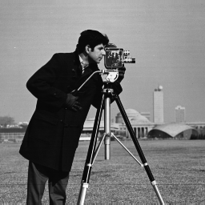
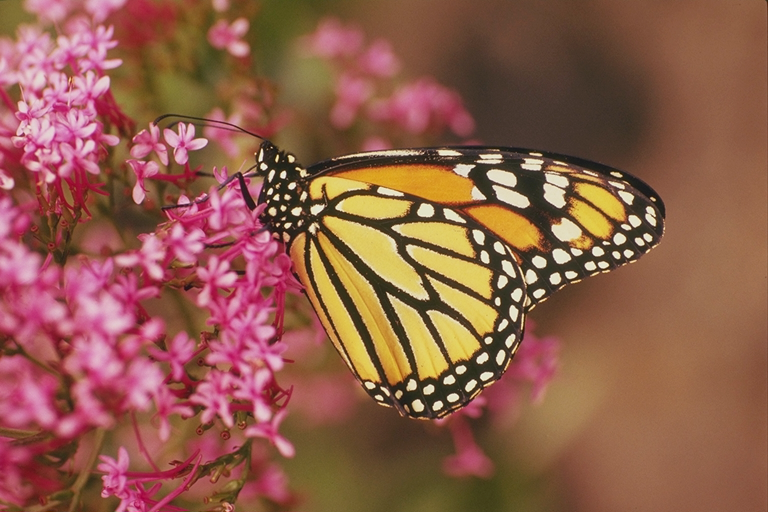
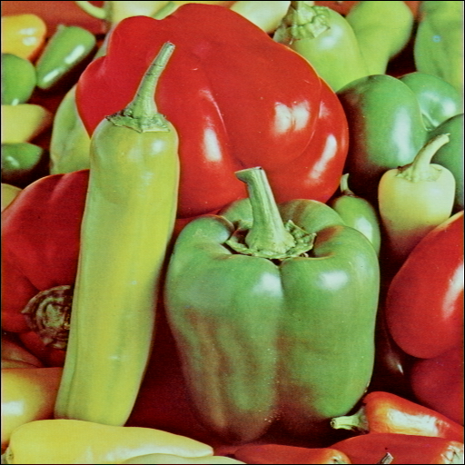

<div align="center">
  
  
  
</div> 

# Image Processing With Numpy
Implementing digital image processing concepts and algorithms using only Numpy and Matplotlib

***

### Features
- Image reading and writing
- Image normalization, rescaling and value clipping
- Channel splitting and merging
- Color conversion: Grayscale, BGR, HSV, HLS, XYZ, Lab, YCbCr, Luv (In development) 

### Setup
[LINUX] To properly use the package, run the following commands:

```
python3 -m venv image_processing
source image_processing/bin/activate
pip install -r requirements.txt
python3 setup.py install
```

You may also install it globally outside of a venv (Matplotlib and Numpy must be installed);


### Examples
To run the usage examples, run ```image_processing/bin/python3 examples/*.py``` with the "*" as the desired example file.
More information about each example file is to be added in a README.md inside the examples folder in the future.

### Contributing
As this is a personal project focused on reviewing and applying concepts that I've studied before,
I don't intend to make it open to contributions just yet. Nevertheless, if you may fork this and use it
for whatever purpose, as well as contacting me using the channels in my main profile readme if you want to 
share any mistakes you may spot in it or provide any feedback or ideas for other project (including collab ones).

***

### Resource credits
Sample images in "inputs/" were downloaded for free from the following image repository: https://links.uwaterloo.ca/Repository.html (and then were converted to ".png")
